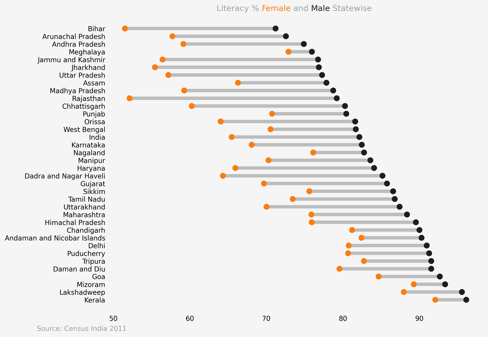

# dumbell_plot
Inspired by https://twitter.com/levikul09 tweet I have created this repository to create
different dumbell plot and in this series the first plot is created with India census 2011 data showing
the difference between male and female literacy rate at state level.

1. Created a dumbell plot showing literacy rate difference between male and female at state level based on India census 2011 data.

2. Created a dumbell plot showing Rural Urban population divide based on India census 2011 data.

3. Created a dumbell plot using plotly showing literacy rate difference between male and female at state level based on India census 2011 data.
[% Literacy Male vs Female Statewise using Plotly](literacyrate_plotly.html)